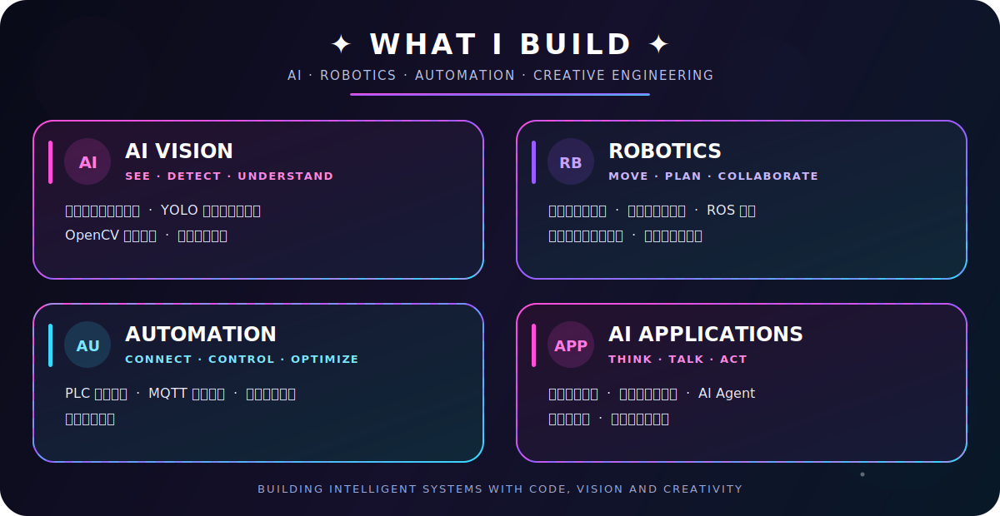

  

---

## ✦ ABOUT ME ✦

### 🐰 你好，我是兔子大王

一名热爱技术、设计与智能设备的 Python 开发者。

专注于 **机器视觉、机械臂、工业自动化与人工智能应用**。

喜欢把复杂的技术，做成真正能够运行、交互和落地的产品。

> ✨ 用代码连接现实，让想法真正运行起来。

---

## ✦ MY TECHNOLOGY UNIVERSE ✦

### 👑 核心开发技术

  

### 🛠️ 开发工具与平台

  

### 🌐 系统与前端技术

  

  

---

---

## ✦ FEATURED PROJECTS ✦

### 🤖 PQControl

**机械臂与机器视觉控制平台**

面向工业自动化场景的可视化控制平台。

支持机械臂、机器视觉、PLC、串口设备和自动化流程控制。

  

 

### 👁️ AI VISION

**工业视觉检测应用**

使用 YOLO、OpenCV 和深度学习模型完成目标检测、缺陷检测、图像处理与视觉定位。

覆盖模型训练、推理服务、工业相机接入和现场部署。

  

 

### 🎙️ INTELLIGENT INTERACTION

**智能语音与设备交互系统**

集成语音唤醒、语音识别、大模型对话、语音合成与工业设备控制。

适用于工业助手、本地智能终端和离线交互场景。

  

---

## ✦ CURRENTLY EXPLORING ✦

  

---

## ✦ CONTRIBUTION SNAKE ✦

<picture>
  <source
    media="(prefers-color-scheme: dark)"
    srcset="./profile-snake-contrib/github-contribution-grid-snake.svg"
  />
  <source
    media="(prefers-color-scheme: light)"
    srcset="./profile-snake-contrib/github-contribution-grid-snake.svg"
  />
  
</picture>

---

## ✦ DEVELOPER ENERGY ✦

🌸 

✨ I don't just write code. I build possibilities.

---

## ✦ CONNECT WITH ME ✦

  

### 🐰 Thanks for visiting my universe

⭐ Welcome to follow my projects and watch me build something amazing

